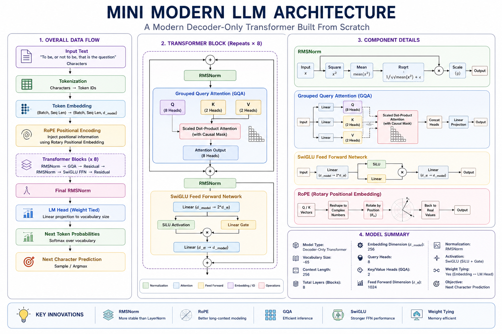
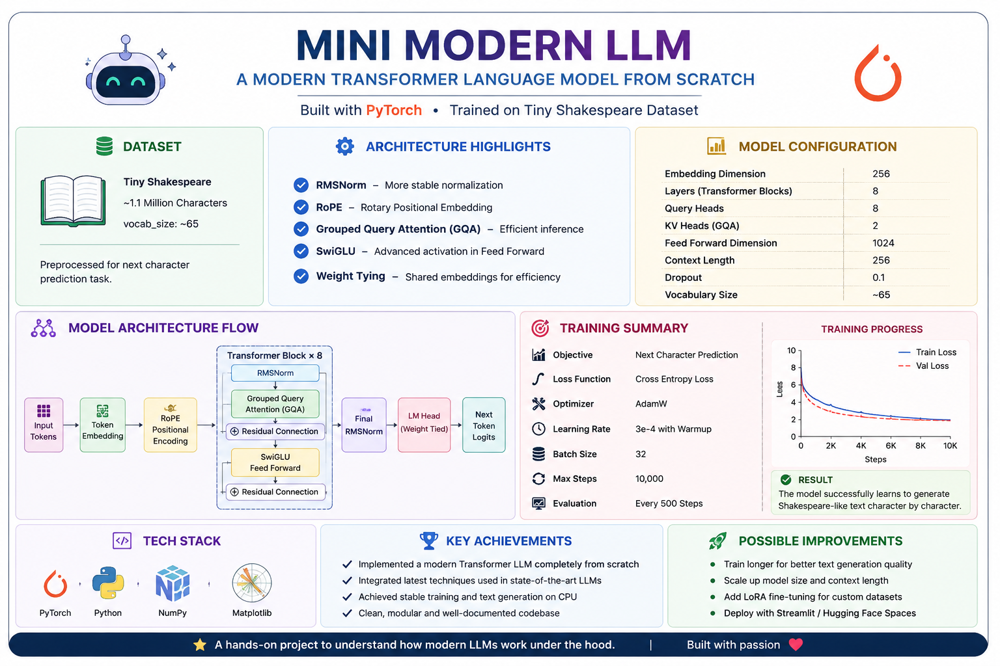

# Mini Modern LLM from Scratch

Built a Modern Transformer Language Model from Scratch using PyTorch with RMSNorm, RoPE, Grouped Query Attention (GQA), and SwiGLU. Trained on the Tiny Shakespeare dataset for next-character prediction.

This project implements several architectural improvements used in modern Large Language Models such as LLaMA, Gemma, Mistral, and Qwen.

## Features

- RMSNorm (Root Mean Square Normalization)
- Rotary Positional Embeddings (RoPE)
- Grouped Query Attention (GQA)
- SwiGLU Feed Forward Network
- Weight Tying
- Causal Self-Attention
- Character-Level Language Modeling
- Tiny Shakespeare Dataset Training

## Architecture

Input Tokens
→ Token Embeddings
→ Transformer Blocks

- RMSNorm
- RoPE
- Grouped Query Attention
- Residual Connection
- SwiGLU Feed Forward Network
→ RMSNorm
→ Language Modeling Head
→ Next Character Prediction

  

## Model Configuration

| Parameter            | Value        |
| -------------------- | ------------ |
| Embedding Dimension  | 256          |
| Transformer Layers   | 8            |
| Query Heads          | 8            |
| KV Heads             | 2            |
| FFN Hidden Dimension | 680          |
| Context Length       | 256          |
| Vocabulary Size      | 65           |
| Parameters           | ~5.5 Million |

## Concepts Implemented

### RMSNorm

A lightweight alternative to LayerNorm that normalizes activations using the Root Mean Square value.

### RoPE

Encodes positional information by rotating Query and Key vectors, allowing attention to naturally capture relative token positions.

### Grouped Query Attention

Reduces memory consumption by sharing Key/Value heads across multiple Query heads.

### SwiGLU

A gated feed-forward network used in modern LLMs for improved expressiveness and training stability.

## Training

Dataset:

- Tiny Shakespeare (~1.1M characters)

Objective:

- Next Character Prediction

Loss Function:

- Cross Entropy Loss

Optimizer:

- AdamW

## Example Output

ROMEO:
O:
HA:
Tha owend tarer st betuertho then'taathe de wer...

The model learns Shakespeare-like formatting, punctuation, and character patterns while demonstrating the complete transformer training pipeline.

## Tech Stack

- Python
- PyTorch
- NumPy
- Matplotlib
- Jupyter Notebook

## Summary

  

## Learning Outcomes

Through this project I gained hands-on experience with:

- Transformer Architecture
- Attention Mechanisms
- Positional Encoding
- Language Model Training
- PyTorch Deep Learning
- Modern LLM Design Patterns

## Future Improvements

- Token-Level Language Modeling
- Flash Attention
- KV Caching
- LoRA Fine-Tuning
- Hugging Face Integration
- Web Deployment with Streamlit

## Author

Sanskar

Computer Engineering Student | AI & Data Engineering Enthusiast
